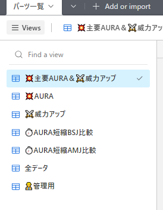
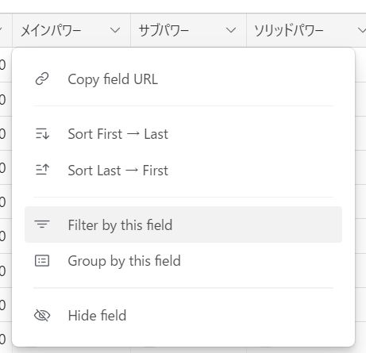
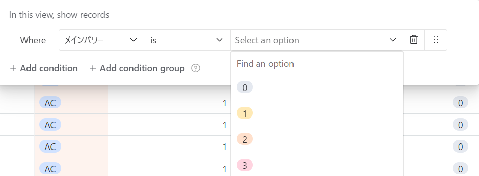
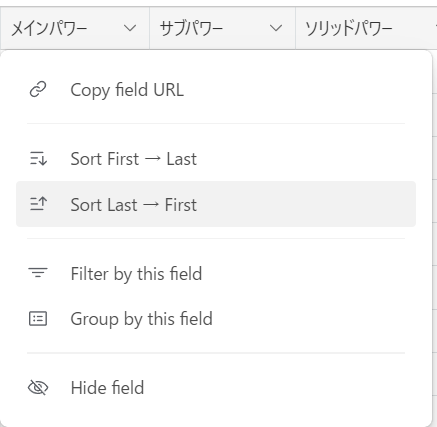
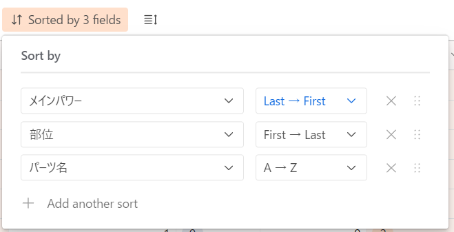
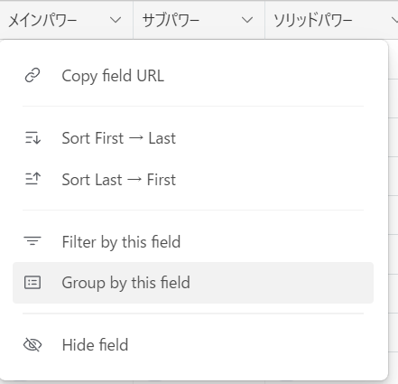
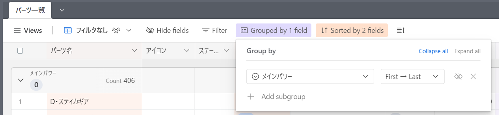
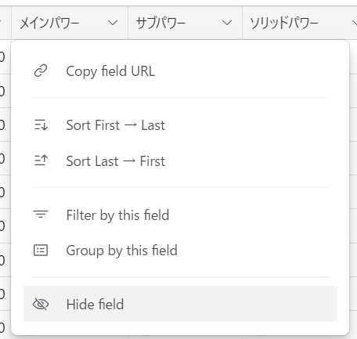
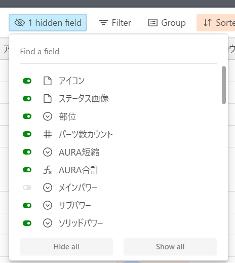

# C21 パーツデータベースについて
## はじめに

[C21 パーツデータベース
](https://airtable.com/appuf9DYawoX4iy6U/shrGynySgJzx5VwgM)は、AURA対応パーツと威力強化効果を持つパーツのデータベースです。

情報源は自身のゲーム内での調査、公式HPの転載、wikiからの転載です。

個人的なデータベースですので、データの抜けや間違いがあると思います。情報提供頂けると助かります。

## とりあえずデータを見る

### ビューを切り替える
あらかじめ条件を設定した表示に切り替えます。よく使いそうな表示を設定してあります。追加要望があればTwitter等で連絡ください。

左端の「Views」ボタンをクリックし、切り替えたいビューをクリックします。

## データを並び替えたり抽出したりする
エクセルに似た操作感覚で、フィルターやソートをしてデータを見やすくできます。

表示を操作した結果は他の人には影響しません。また、ブラウザを切り替えると表示はリセットされます。

### フィルターをかける
条件に合致する行だけを表示します。複数条件を指定できます。

フィルターをかけたい列のヘッダーを右クリックし、「Filter by this field」をクリックします。

その後の画面で、フィルターの条件を指定します。

### ソートする
条件を指定して行を並べ替えます。複数条件を指定でき、条件の優先度を指定することができます。

フィルターをかけたい列のヘッダーを右クリックし、「Sort by this field」をクリックします。

その後の画面で、ソートの条件を指定します。

### グループ化する
条件を指定してグループ化します。ソートに似ていますが、表示が条件ごとに階層化されるため、見やすくなります。

また、複数条件を指定でき、条件の優先度を入れ替えることができます。

フィルターをかけたい列のヘッダーを右クリックし、「Group by this field」をクリックします。

その後の画面で、グループ化の条件を指定します。

### 列を非表示にする
列を非表示にします。いらないAURAレベルを非表示にするときなどに便利です。

非表示にしたい列のヘッダーを右クリックし、「Hide this field」をクリックします。

上部の「Hide fields」ボタンから、表示／非表示をまとめて設定することもできます。

**copyright(c) 2006 - 2023 CyberStep, Inc. All Rights Reserved.**
